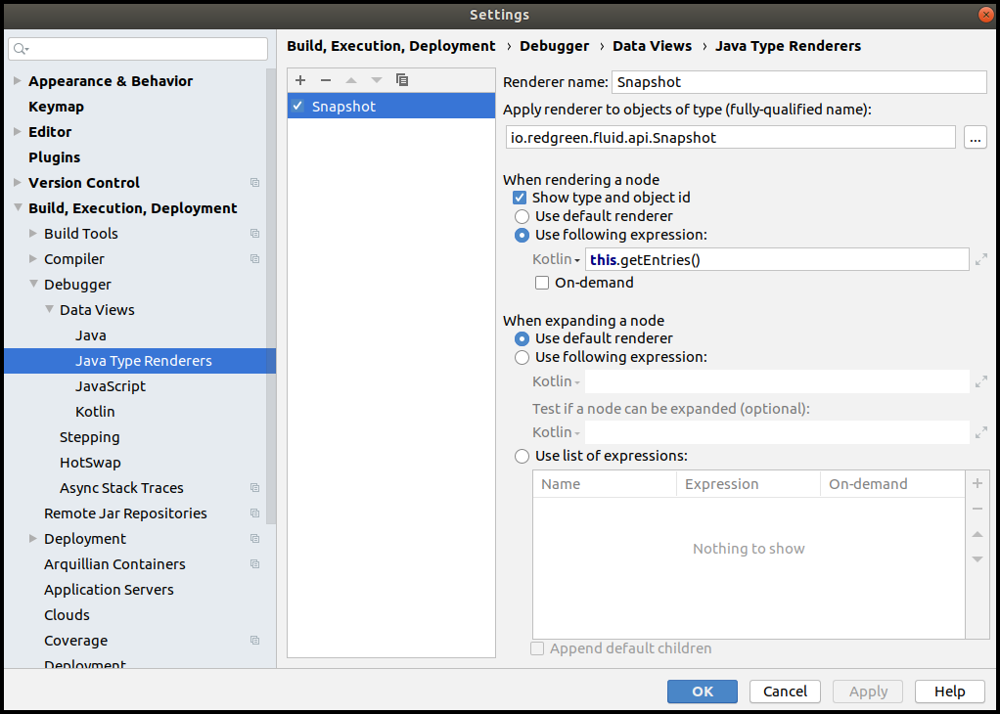
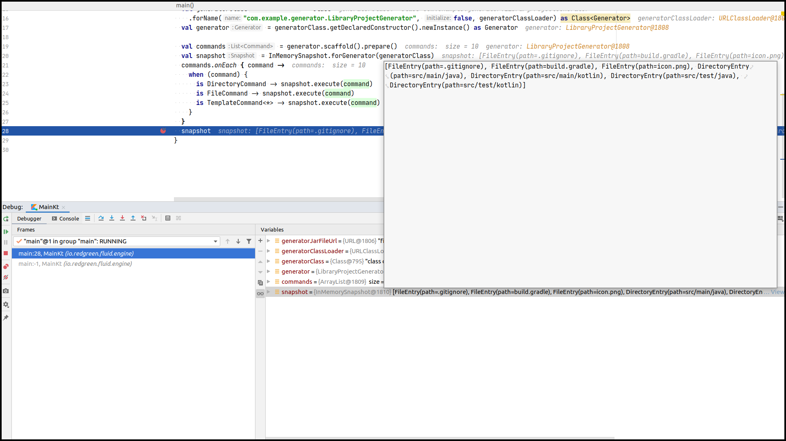

# Fluid
Fluid is a scaffolding tool inspired by [Yeoman](https://yeoman.io/).

## Installation
```bash
$ curl -sSLO https://github.com/redgreenio/fluid/releases/download/[version]/fluid &&
    chmod a+x fluid &&
    sudo mv fluid /usr/local/bin/
```

## Development
### IntelliJ Run Configurations
The following run configurations help us test various installation scenarios with the CLI.

#### 1. [cli] install
Installs *valid-generator.jar* in the local registry.

#### 2. [cli] reinstall (different sha256)
Run this configuration after **[cli] install**. Reproduces the installation scenario where the installed generator has the same version number but a different hash. 

#### 3. [cli] install (different version)
Run this configuration after **[cli] install**. Reproduces the installation scenario where the installed generator has a different version number.

#### 4. [cli] run
Run this configuration after **[cli] install**. Runs the *valid-generator.jar* and generates contents into the **/pokran** directory.

#### 5. [cli] help
Prints help.

#### 6. [cli] version
Prints version information.

### Installing the in-development Fluid binary on your local machine
Use the [cli-local-install](cli-local-install) convenience Shell script to install the **fluid** binary on your local machine during development.

### Working with Jars
Depending on the module that you are working in, you may have to work with JARs. Here are some of the commands that can help with the workflow.

#### 1. List the table of contents of a jar file.
```bash
$ jar tf my-jar.jar
```

**Output**
```
META-INF/
META-INF/MANIFEST.MF
com/
com/example/
com/example/generator/
com/example/generator/LibraryProjectConfig.class
com/example/generator/LibraryProjectGenerator.class
strawberry.png
```

#### 2. List the table of contents with additional information.
```bash
$ jar tfv my-jar.jar
```

**Output**
```
     0 Sat Apr 11 11:08:38 IST 2020 META-INF/
   332 Sat Apr 11 11:08:38 IST 2020 META-INF/MANIFEST.MF
     0 Sat Apr 11 11:08:38 IST 2020 com/
     0 Sat Apr 11 11:08:38 IST 2020 com/example/
     0 Sat Apr 11 11:08:38 IST 2020 com/example/generator/
  2680 Sat Apr 11 11:08:38 IST 2020 com/example/generator/LibraryProjectConfig.class
  1411 Sat Apr 11 11:08:38 IST 2020 com/example/generator/LibraryProjectGenerator.class
 24246 Sat Apr 11 11:08:38 IST 2020 strawberry.png
```

#### 3. Extract one or more file(s) from the jar.
```bash
$ jar xf my-jar.jar META-INF/MANIFEST.MF 
```

### Debugging
Working with snapshots during debugging could be tricky. You can make it easier by creating an IntelliJ Java Type Renderer. The screenshots below give you information on how to create and use your type renderer.



Working with snapshots during debugging could be tricky. You can make it easier by creating an IntelliJ Java Type Renderer. The screenshots below give you information on how to create and use your type renderer. 



### Attribution
[Strawberry](core/src/test/resources/strawberry.png) by Luis Prado from the Noun Project

```
© Copyright 2020 Red Green, Inc.
```
